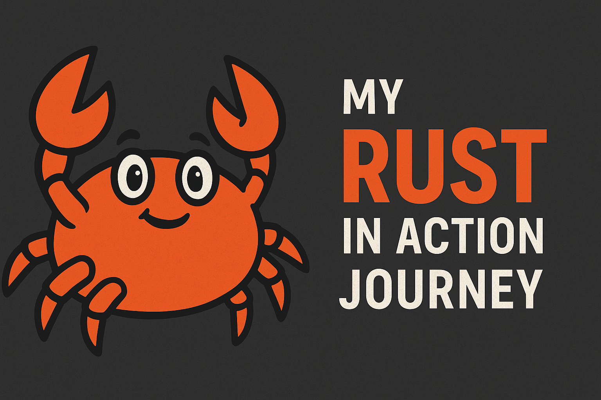

> A personal learning repository where I explore [*Rust in Action*](https://www.manning.com/books/rust-in-action) — one chapter, one project at a time.

---

## 📚 About This Repository

This repo serves as a **learning log and project space** as I read through *Rust in Action*. My goal is not just to follow along, but to truly understand the concepts by building and experimenting.

To enhance learning, I’ve developed a custom process:

### 🛠️ My Learning Rules

- 🧾 For each exercise, instead of jumping straight to the provided solutions, I ask ChatGPT to generate a **Practical Sheet** — guided exercises that help me think through the project step-by-step. These are included in each folder.
- 🤖 I intentionally **avoid using LLMs to write code directly**. I may ask questions or seek clarification (like a mentor), but all implementations are my own — which means some solutions may differ from the book's, but they work!

---

## ✅ Progress Tracker

| Chapter | Title | Status |
|--------:|:------|:------:|
| 1 | Introducing Rust | ✅ Completed |
| 2 | Language Foundation |  ✅ Completed  |
| 3 | Compound Data Types |   ✅ Completed    |
| 4 | Ownership, Borrowing & Lifetimes | 🚧 In Progress  |
| 5 | Data in Depth | ⬜ Not Started |
| 6 | Memory | ⬜ Not Started |
| 7 | Files and Storage | ⬜ Not Started |
| 8 | Networking | ⬜ Not Started |
| 9 | Time and Timekeeping | ⬜ Not Started |
| 10 | Processes, Threads & Containers | ⬜ Not Started |
| 11 | Kernel | ⬜ Not Started |
| 12 | Signals, Interrupts & Exceptions | ⬜ Not Started |

---

## 🧠 Why This Approach?

I learn best by doing — and by occasionally failing, fixing, and reflecting. This method:

- Reinforces the fundamentals of systems programming in Rust
- Builds problem-solving intuition
- Keeps the learning active and not just passive reading
